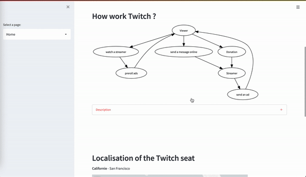
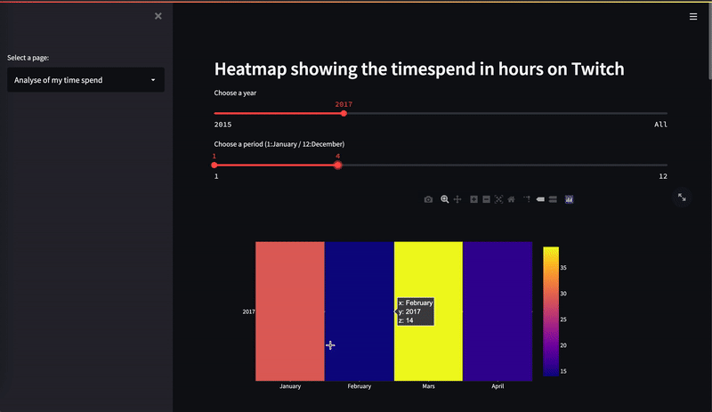
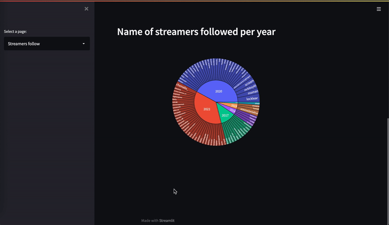
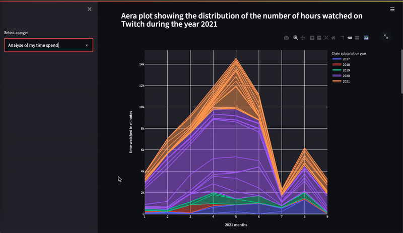

 

  

#   Introduction 

I'm a 21 student specialize in <strong>Big data & Machine learning </strong> and I'm presenting to you my work on my <strong> Personnal Twitch Data </strong>. I discovered this streaming platform in 2015 and until today I watch streamers on it. So, I'm a big consumer of this and I have enjoyed working on this project. This project contain more than <strong> 10 Data representations </strong> tools like <em> Bar/Scatter/Aera plot, bar chart race, wordcloud and heatmap </em>. Some of them can be personalize, thanks to widgets.
   So I hope that you will like it! 

  

#   Librairies needed

To install these librairies you need to download anaconda before and install it on your own environnement.   <em> Wordcloud librairie with pip isn't working on streamlit, that's why you need to use anaconda.  </em>

    You also need to install ffmep, this logiciel will create the little video from the bar chart race.   Here is the download link : https://www.ffmpeg.org/

<ul>
    <li>Pandas</li>
    <li>Numpy</li>
    <li>Scikit-learn</li>
    <li>Matplotlib</li>
    <li>Plotly express</li>
    <li>Plotlty graph objects</li>
    <li>Bar chart race</li>
    <li>Functools</li>
    <li>Cv2</li>
    <li>PIL</li>
    <li>Streamlit</li>
    <li>Time</li>
    <li>Graphviz</li>
    <li>Pydeck</li>
    <li>Folium</li>
    <li>Streamlit folium</li>
</ul>

  

     [ <strong> Important </strong> Turn your theme in dark mode 🌙 ] 
 

  

#  Some exemples of the content

 
 

  

  

First page 

